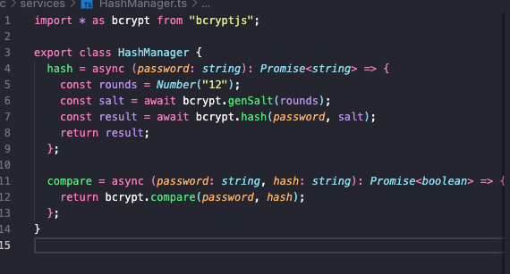
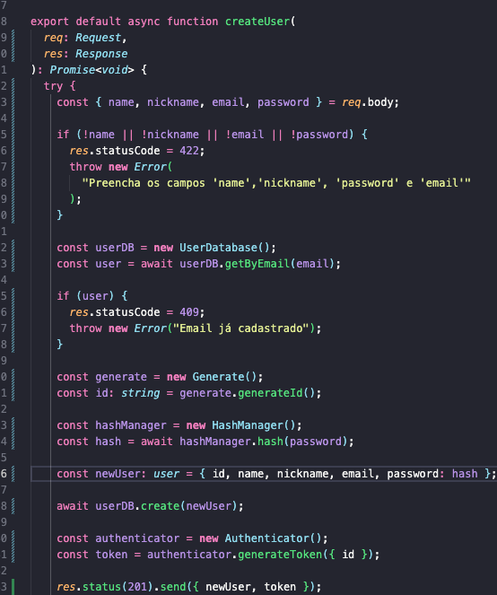
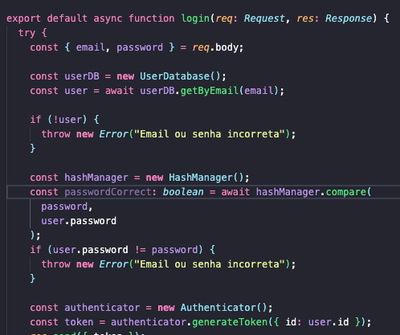
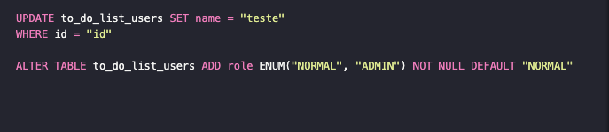
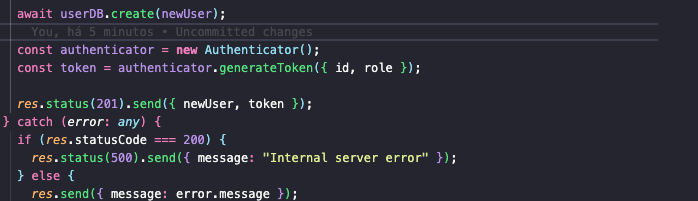

### Exercício 01
a) Cost está relacionado a segurança do sistema. salt é um string aleatória adicionada a senha que evita ataques chamados rainbow table.

b),c) 

### Exercício 02
a) primeiro devemos substituir o cadastro.

b) 

c) 

### Exercício 03
a) 

b) 