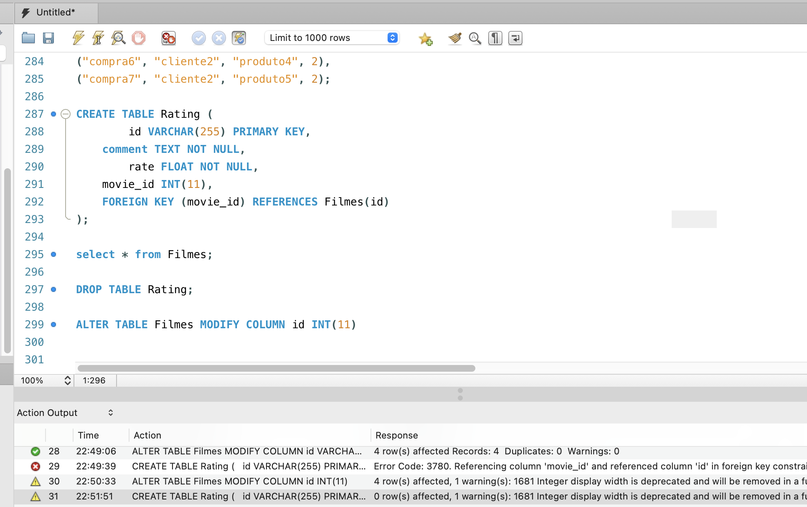
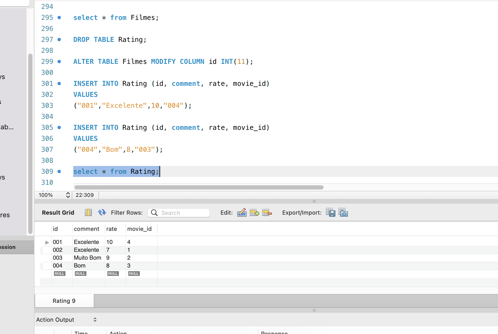
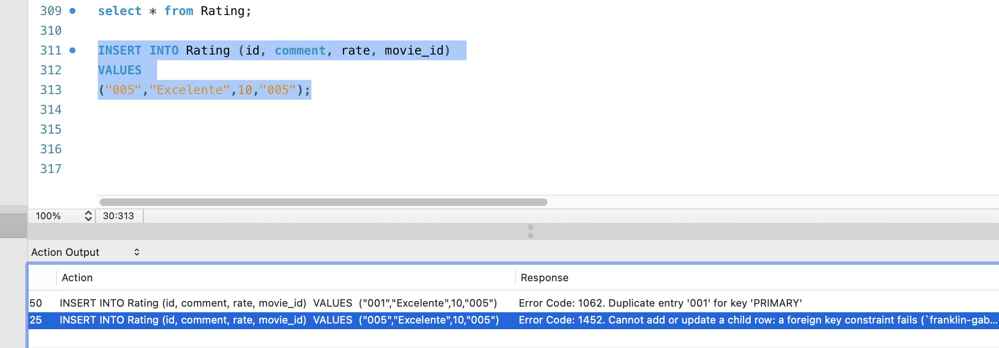
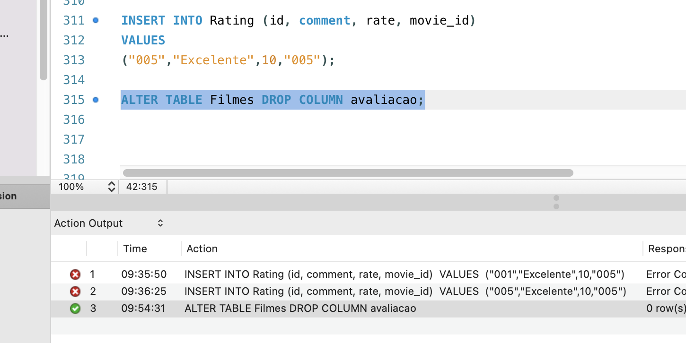
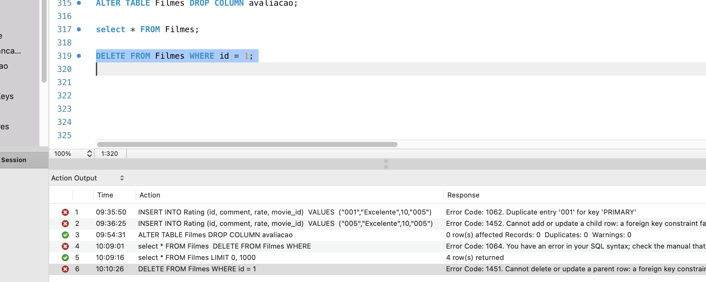
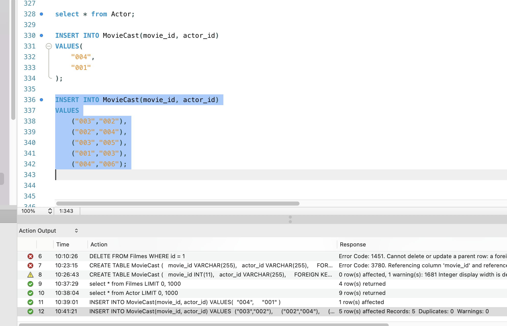

## Exercício 01

* Chave estrangeira (foreign key) é o campo que estabelece o relacionamento entre duas tabelas. Assim, uma coluna corresponde à mesma coluna que é a chave primária de outra tabela. Dessa forma, deve-se especificar na tabela que contém a chave estrangeira quais são essas colunas e à qual tabela está relacionada. O banco de dados irá verificar se todos os campos que fazem referências à tabela estão especificados.

* Adicionando tabela rating

* Adiconando rows a tabela 

* Tente criar uma avaliação para um filme que não existe (ou seja, um id inválido). O banco não consegue relacionar o id invalido a tabela de referencia.

* ltere a tabela de filmes para que ela não tenha mais uma coluna chamada rating.

* Tente apagar um filme que possua avaliações. não pode excluir ou atualizar uma linha pai uma restrição de chave estrangeira.

## Exercício 02

* Os relacionamentos do tipo N:N (muitos para muitos) ocorrem quando vários registros de uma tabela se relacionam a vários registros de outra. Ou seja, em nenhum dos lados há exclusividade no relacionamento.

* Tente criar uma relação com um filme ou um ator inexistente. O banco não consegue relacionar o id invalido a tabela de referencia.

* Tente apagar um ator que possua uma relação nessa tabela. não pode excluir ou atualizar uma linha pai uma restrição de chave estrangeira.

## Exercício 03

